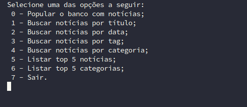

## A Aplicação

Essa aplicação é um web scrapper que visita [esse blog](https://blog.betrybe.com/) e faz a raspagem dos dados. A partir dessa raspagem a aplicação é capaz de fazer alguns filtros nos dados encontrados.

### Antes de testar

Crie o ambiente virtual para o projeto rodando o código abaixo.

```sh
python3 -m venv .venv && source .venv/bin/activate
```

Instale as dependências rodando o código abaixo.

```sh
python3 -m pip install -r dev-requirements.txt
```

### Testando a aplicação

Nele existe um script para rodar algumas opções do projeto. Para roda-lo basta acessar o terminal e digitar:

```shell
tech-news-analyzer
```

Isso Abrirá um menu com opções do que você gostaria de fazer, como na imagem abaixo



### As opções do menu

Cada opção do menu é responsável por rodar uma função do código. E as funções são listadas abaixo:

#### 0- Popular o banco com notícias;

Faz a raspagem dos dados e popula o banco com as informações

#### 1-4 Buscar noticias por parâmetro.

Faz uma busca no banco de dados e retorna somente noticias que atendam ao parâmetro passado.

#### 5 - Listar top 5 Notícias

Busca no banco de dados quais são as noticias com mais comentários e mostra as 5 primeiras.

#### 6 - Listar top 6 Categorias

Busca no banco de dados qual a maior recorrência de categorias dos posts e retorna as 5 mais recorrentes.

#### 7 - Sair

Finaliza o Script.

### Principais Tecnologias utilizadas

<a href="https://www.mongodb.com/" target="_blank" rel="noreferrer">  </a> <a href="https://www.python.org" target="_blank" rel="noreferrer">  </a>
